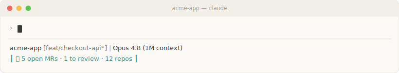

# mannutech — Claude Code plugin marketplace

A [Claude Code plugin marketplace](https://code.claude.com/docs/en/plugins). Currently hosts two plugins:

- **ContextSpin** — live context in your Claude Code status bar (weather, Hacker News, AI research papers, dev articles, PRs awaiting review, CI failures, incidents, meetings), pulled from tools you already run.
- **RecallCheck** — quiz yourself on the code you just wrote: an on-demand comprehension self-check on your current diff, plus optional non-blocking nudges before you push or open an MR. No scoring, no gating.



## Add this marketplace

In Claude Code:

```
/plugin marketplace add mannutech/claude-plugins
/plugin install contextspin@mannutech
/plugin install recallcheck@mannutech
```

## Plugins

| Plugin | What it does |
|---|---|
| [`contextspin`](https://github.com/mannutech/contextspin-plugin) | Auto-configures a never-empty, live status bar. Wraps the [`contextspin`](https://www.npmjs.com/package/contextspin) npm package. |
| [`recallcheck`](https://github.com/mannutech/recallcheck) | `/recallcheck:recall-check` quizzes you on the code you just wrote (3–5 questions on the current diff). Optional non-blocking pre-push/stop nudges. Self-contained; no npm package. |

## Don't want the marketplace?

ContextSpin installs in one line without any plugin:

```bash
curl -fsSL https://raw.githubusercontent.com/mannutech/contextspin/main/install.sh | bash
```

## License

MIT.
